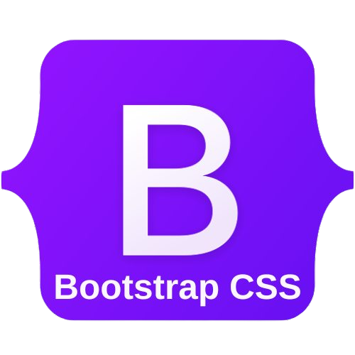
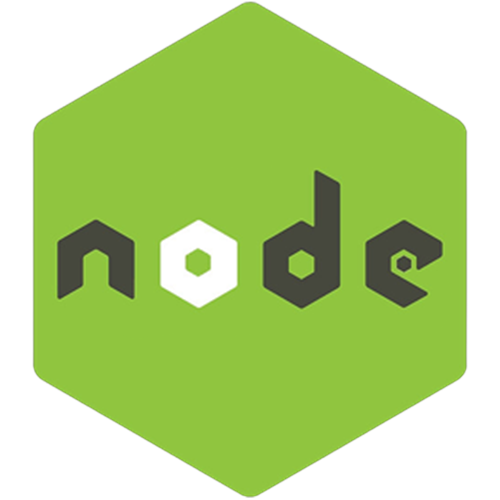

### Hi there 👋
​
My name is Dylan and I'm a full MERN stack developer! 
If you'd like to contact me or check out my socials you can  
find the links below!
​

<!-- [Twitter](https://twitter.com/dcrowdev)  
[LinkedIn](https://www.linkedin.com/in/dylan-crowley-3974b8252/)  
dcrowdev1025@gmail.com -->

## -------- Technologies ----------

<!-- 

  
  
  
  
  
  
  

 -->

                  

## -------- Connect With Me! ----------

&nbsp;&nbsp;&nbsp;&nbsp;&nbsp;&nbsp;&nbsp;

##

 
 
 

 
 
 

